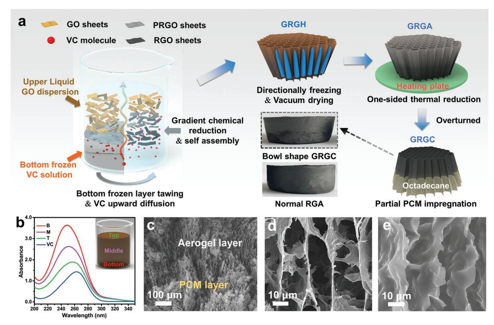
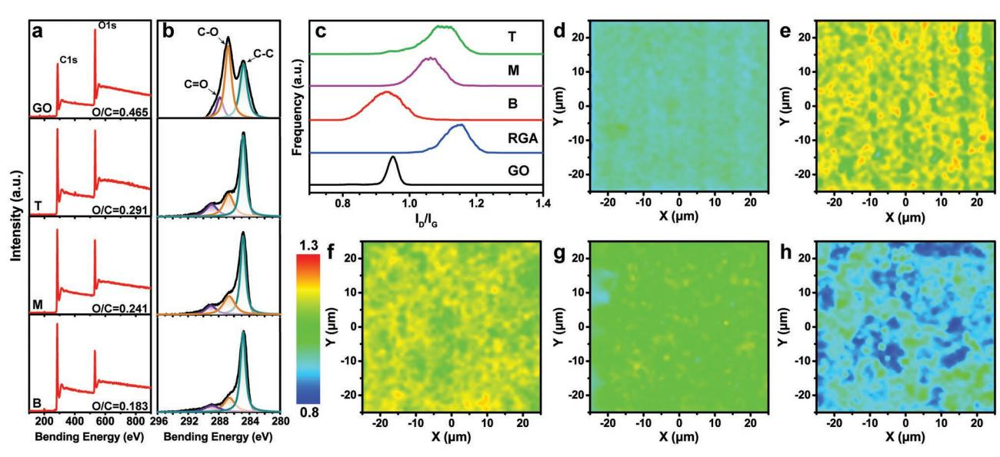
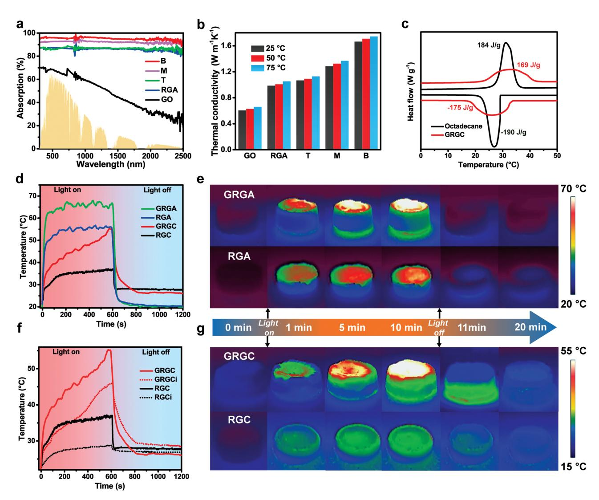
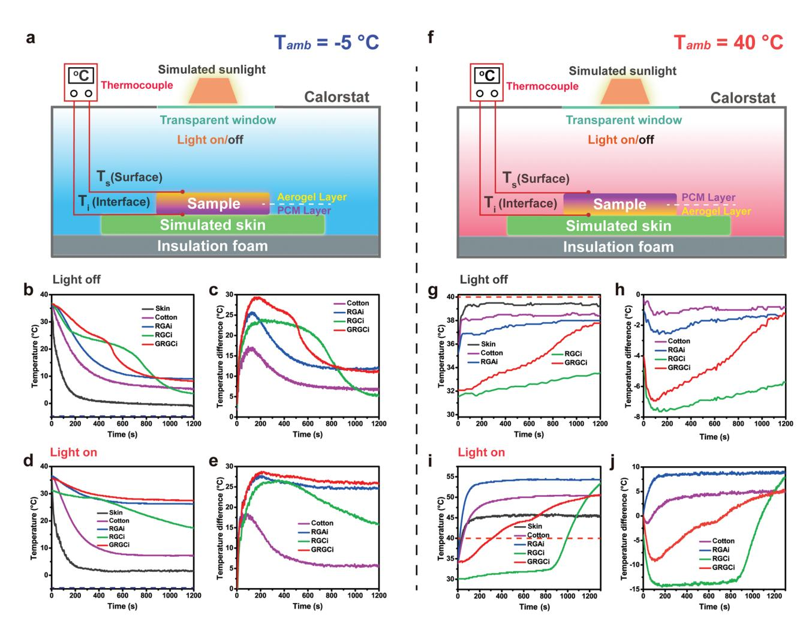
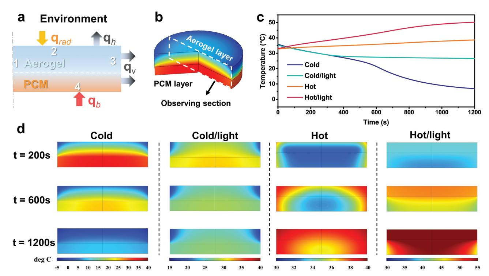

**www.afm-journal.de**

# **Nature-Inspired Solar-Thermal Gradient Reduced Graphene Oxide Aerogel-based Bilayer Phase Change Composites for Self-Adaptive Personal Thermal Management**

*Zhuo Luo, Dongzhi Yang,\* Ji Liu, Hao-Yu Zhao, Tianyu Zhao, Bai-Xue Li, Wei-Guang Yang, and Zhong-Zhen Yu\**

**Although personal thermal management (PTM) materials for daily routine environments are widely investigated, the exploration of multifunctional PTM materials with excellent feasibility in complex and outdoor scenarios is still in its infancy. Herein, inspired by the temperature regulation effect of the atmosphere, a novel design for fabricating solar-thermal gradient reduced graphene oxide (RGO) aerogel-based bilayer phase change composite (GRGC) featuring "energy regulation" and "energy inverse compensation" is proposed for selfadaptive PTM applications. By integrating the solar-thermal energy conversion ability of RGO, the heat regulation of the aerogel/octadecane bilayer structure with the unique gradient RGO framework inside, and the latent-heat compensation of octadecane, the bilayer GRGC can serve as an efficient PTM device to mitigate drastic temperature changes of human skin in harsh environments. This multifunctional PTM device can not only keep a warm skin surface microclimate in a frigid environment of −5 °C via the synergistic effect of the solar-thermal conversion, the aerogel thermal insulation, and the phase-change latent heat release, but also provide efficient thermal buffering to prevent hyperthermia in hot environments through its phase-change behavior and its thermal insulation. This gradient and bilayer design opens a new avenue for fabricating self-adaptive PTM devices for applications in harsh environments.**

Z. Luo, D. Yang, H.-Y. Zhao, B.-X. Li

State Key Laboratory of Organic-Inorganic Composites

College of Materials Science and Engineering

Beijing University of Chemical Technology

Beijing 100029, China

E-mail: yangdz@mail.buct.edu.cn

Z. Luo, T. Zhao, W.-G. Yang, Z.-Z. Yu

Beijing Key Laboratory of Advanced Functional Polymer Composites

Beijing University of Chemical Technology

Beijing 100029, China

E-mail: yuzz@mail.buct.edu.cn

J. Liu

School of Chemistry CRANN and AMBER

Trinity College Dublin Dublin 999015, Ireland

The ORCID identification number(s) for the author(s) of this article can be found under https://doi.org/10.1002/adfm.202212032.

**DOI: 10.1002/adfm.202212032**

## **1. Introduction**

With the increasing pursuit of a comfortable thermal environment for human body in daily work and life, most of the residential and commercial electricity is consumed for indoor heating or cooling, accounting for 40% of the world's total energy consumption.[1] Conventional strategies for regulating the temperature of bulk spaces in buildings require excessive energy consumption owing to their inevitable heat loss to external environments and are not as effective as applying directly to the individual temperature regulation.[2] Moreover, space heating/cooling methods, such as heating, ventilation, and air conditioning, cannot meet the needs of different individuals that have different thermal comfort requirement, nor are they suitable for outdoor environments.

Different from centralized heating/ cooling strategies, personal thermal management (PTM) technology aims to realize "local thermal regulation" in individuallevel.[3] The PTM devices can provide accurate and appropriate thermal comfort for different individuals in complex envi-

ronments, achieving high application flexibility, high energyefficiency, easy controllability, and the availability for outdoor scenarios, which has a great significance to mitigate the energy crisis and greenhouse effect as well.[4] Till now, various materials and devices are developed for PTM applications, such as dynamic regulation textiles,[5] sweat-management materials,[6] radiation heating/cooling textiles,[7] active heating fabrics,[8] phase-change thermoregulation garments.[9] Based on the principles of air convection, evaporation dissipation, infrared thermal radiation heating/cooling, and heat conduction control, the mentioned devices are dexterously designed to regulate the surface microenvironments of individuals and exhibit decent performances in normal environments.[10] However, for special groups including soldiers, firefighters, and scientific expedition teams working in harsh environments, sudden and drastic temperature changes may cause great risks to their health and even threaten their lives.[11] In this case, smart PTM devices that can adjust temperature adaptively to ensure basic thermal comfort

for users in various environments are urgently required.[12] Unfortunately, the exploration and development of multifunctional PTM materials with excellent feasibility in complex outdoor scenarios are still in its infancy and remains inadequate.[13]

Similar to the situation that human faced in harsh environments, the Earth is also exposed to freezing space and strong thermal irradiation, but it can miraculously maintain an moderate temperature range for lives unlike moon or Mars, which is mainly attributed to the external solar energy absorption and internal atmosphere buffering (Figure S1, Supporting Information).[14] By analogy, the construction of dynamic surface microenvironments that can adjust energy input and output with external system is the key for all-weather PTM devices. Herein, inspired by the atmospheric temperature regulation effect, for the first time, we propose a gradient and bilayer design for the fabrication of a solar-thermal gradient reduced graphene oxide (RGO) aerogel-based phase change composite (GRGC) with "energy regulation" and "energy inverse compensation" features for self-adaptive PTM applications in harsh environments. This GRGC is mainly prepared by bottom-up gradient chemical reduction of graphene oxide (GO) followed by unidirectionalfreezing, lyophilization, bottom-side thermal reduction, and partial impregnation of octadecane phase change material (PCM). First, the gradient RGO hydrogel (GRGH) is obtained by gradient chemical reduction and hydrothermal self-assembly of an aqueous suspension of GO with the gradiently distributed ascorbic acid (VC) reductant along the vertical direction. Subsequently, both unidirectional-freezing and lyophilization are adopted to convert the hydrogel to an anisotropic aerogel with numerous vertical porous channels. Furthermore, the bottomside thermal reduction of the anisotropic aerogel at 300 °C further enlarges the difference in reduction extent along its vertical direction, generating a gradient RGO aerogel (GRGA) with a heavily reduced bottom part and a weakly reduced top part. Finally, the partial impregnation of molten octadecane PCM in the weakly reduced part of the GRGA endows it with temperature regulation ability via latent-heat storage and release of the octadecane, while the heavily reduced aerogel layer keeps its porous structure for solar-thermal energy conversion and thermal insulation. This GRGC tactfully integrates the solarthermal energy conversion capacity of the heavily reduced RGO, the thermal insulation of the porous RGO aerogel layer, and the heat storage and release of the octadecane PCM layer, which is efficient in stabilizing the skin temperatures within a comfortable range (Figure S2, Supporting Information). For example, in a cold environment, the heavily reduced aerogel layer of the GRGC can prevent the internal heat loss via its thermally insulating porous structure and generate solar-driven heat to provide a warm external surface via its solar-thermal energy conversion, while the octadecane PCM layer of the GRGC contacting the simulated skin can release its latent heat to warm the skin. Similarly, in a hot environment, the PCM layer exposing to the air can prevent the skin from overheating by its phase-change behavior, and the porous aerogel layer contacting the simulated skin can provide thermal insulation.[15] Thus, the multifunctional GRGC with the unique gradient and bilayer structure is efficient in temperature regulation in complex thermal environments, holding a great promise for PTM applications.

## **2. Result and Discussion**

**Figure 1** illustrates the fabrication of the solar-thermal selfadaptive gradient RGO aerogel-based phase change composites by bottom-up gradient chemical reduction of GO dispersion, unidirectional-freezing, lyophilization, bottom-side thermal reduction, and partial impregnation of octadecane phase change material. First, an aqueous dispersion of GO is poured into a glass mold containing already frozen VC solution. As the temperature of the frozen VC solution rises back to room temperature, it starts to thaw and diffuse spontaneously from the bottom to the top of the GO dispersion. Subsequently, the mold is placed on a 70 °C heating plate to accelerate the thawing and diffusion processes. In general, the diffusion of VC in water is irregular and it will reach an equilibrium state with a completely uniform distribution in the solution due to the Brownian motion. However, under the obstruction of the GO dispersion, the upward diffusion of the VC molecules needs to overcome the gravity, viscosity, and van der Waals forces, resulting in gradual decreases in the VC concentration from the bottom to the top part of the dispersion.[16] In this case, the VC molecules will present a gradient distribution in the GO dispersion along the vertical direction as a matter of course (Figure 1b).

To visualize the diffusion process, fluorescein sodium is added into the VC aqueous solution to track the diffusion and exchange behavior of the GO suspension and the VC solution at the interface. Because of the existence of fluorescein sodium, the frozen VC solution appears bright yellow. With the thawing of the frozen VC solution, the yellow solution gradually diffuses upward, forming a distinct green boundary (Figure S3, Supporting Information). With prolonging the heating time, the boundary spreads up and its color becomes lighter. The fluorescence microscopy images demonstrate that, with the increase of the sampling height, the fluorescence effect becomes weaker due to the lower concentration of the fluorescence molecule, verifying the gradient distribution of VC in the GO dispersion (Figures S4 and S5, Supporting Information). The gradient chemical reduction with the VC during the hydrothermal assembly process leads to the formation of the gradiently reduced RGO hydrogel, in which the partially reduced GO sheets assemble into a 3D network by their restored *π*–*π* conjugation interactions.[17] During the self-assembly process, a distinct interface appears between the upper brown GO dispersion and the lower solid RGO hydrogel in an initial stage (Figure S6, Supporting Information). Subsequently, the lower hydrogel with a higher reduction extent tends to shrink, while the upper hydrogel almost keeps its initial shape because of the weaker chemical reduction, leading to the bowl shape of the resultant hydrogel and aerogel (Figure 1a). When the GRGH is dipped in water, its relatively hydrophobic bottom surface generates compact air bubbles, while its top surface is fully wetted by water without apparent bubbles, further confirming the gradient reduction of the GRGH along its vertical direction (Figure S7, Supporting Information).

To generate vertical microchannels, the GRGH is placed on a copper pillar cooled by liquid nitrogen for unidirectionalfreezing. Driven by the temperature gradient from the bottom to the top of the hydrogel, numerous ice pillars initiate and grow vertically inside the hydrogel. As a result, the RGO sheets

**Figure 1.** a) Schematic illustrating the fabrication process of the GRGC, where the PRGO refers to the partially reduced graphene oxide. b) UV spectra of the VC solution (20 µg mL−1 ), and the gradient dispersion sampling from the bottom (B), middle (M), and top (T) parts that are diluted for 1000 times before the UV–vis measurements. SEM images of c) GRGC, and its magnified d) aerogel layer and e) PCM layer.

are expelled by the vertical ice pillars and are aligned vertically. Subsequently, the gradient RGO aerogel is obtained by freezedrying the unidirectionally-frozen GRGH via subliming the numerous ice pillars. The gradiently reduced RGO structure is further intensified by heating the anisotropic GRGA with its bottom contacting the heating plate of 300 °C, leading to a higher thermal reduction extent of the RGO in the bottom part of the aerogel than in the top part.[18] As the heavily reduced RGO part is more suitable for solar light absorption and solarthermal energy conversion, the GRGA is turned upside down and its weakly reduced part is impregnated with the molten octadecane PCM; whereas, the heavily reduced part remains its porous channels for thermal insulation (Figure 1c–e). For comparison, typical RGO aerogel (RGA) is prepared by hydrothermally reducing the GO suspension with uniformly dispersed VC, random freezing, and freezing-drying. The RGA-based phase change composite (RGC) is obtained by fully impregnating with molten octadecane at 60 °C.

The different thermal reduction extents along the vertical direction of the GRGA are evaluated with its X-ray photoelectron spectra (XPS) (**Figure 2**a). The pristine GO exhibits a O/C ratio of 0.465 owing to its abundant oxygen-containing groups. After the thermal annealing at 300 °C for 5 min, the O/C ratio decreases to 0.291 for the top part, which is far from the heating plate, and 0.183 for the bottom part that is close to the heating plate. The O/C ratio of the middle part (0.241) is just between those of the top and bottom parts. Besides, the high-resolution C 1s spectra show that the intensities of CO and CO peaks at 286.6 and 289.0 eV decline with decreasing the sampling height (as well as the heating distance) (Figure 2b). All these results verify the gradient reduction structure of the GRGA realized by the gradient chemical reduction of VC and subsequent bottomside thermal annealing, which is also supported by the XRD patterns of the GRGA (Figure S8, Supporting Information). In addition, the reduction extent of the GRGA can be tuned by varying the thermal annealing time. Note that a short annealing time would cause insignificant gradients and poor reduction of the bottom part, while a prolonged annealing could lead to higher reduction extents but diminish the gradient structure (Figure S9, Supporting Information). Therefore, an optimal annealing time of 5 min is adopted for preparing the GRGAs for novel phase change composites toward PTM applications.

The reduction extents of different parts of the GRGA are further evaluated by Raman spectra and mappings (Figure S10, Supporting Information). The GO exhibits two typical peaks at ≈1350 and ≈1580 cm−1 , corresponding to its defect and graphite peaks, respectively. The graphitic peak originates from the sp2 hybrid carbon in the hexagonal lattice of graphene, while the defect peak is mainly related to the disorder arrangement and structural defects of sp3 hybrid carbon.[19] The intensity ratio of D and G bands (*I*D/*I*G) demonstrates the defect density and graphitization extent. The RGA has an *I*D/*I*G value of 1.17,

**Figure 2.** a) XPS survey spectra, and b) high-resolution C 1s spectra of GO, top part (T), middle part (M), and bottom part (B) of GRGA. c) *I*D/*I*G distributions, and Raman mappings of d) GO, e) RGA, f) top part, g) middle part, and h) bottom part of GRGA. The blue, green, and red colors correspond to their *I*D/*I*G values of ≈0.8, ≈1.0, and ≈1.3, respectively.

higher than that of GO (0.96), which is ascribed to the introduced defects caused by the removal of oxygen-containing groups. After the thermal annealing, the *I*D/*I*G values of the top, middle and bottom parts of the GRGA are 1.13, 1.04 and 0.91, respectively, indicating the different extents of the repairment of defects along the vertical direction, which can also be reflected visually by the Raman mapping images.[20] Apparently, the Raman mapping images of GO (Figure 2d) and RGA (Figure 2e) show apparent major cyan (*I*D/*I*G ≈ 0.95) and green (*I*D/*I*G ≈ 1.1) colors, respectively. Nevertheless, the discrete blue regions corresponding to lower *I*D/*I*G values start to appear in the Raman mapping of the GRGA and the blue region gradually expands from the top part to the bottom part (Figure 2f–h), illustrating that the graphitization extent of the GRGA keeps relatively uniform in horizontal directions whereas changes significantly along the vertical direction. The frequency distribution statistics of the *I*D/*I*G in the Raman mappings (Figure 2c) intuitively exhibit the increase of the distribution peak value from 0.95 for GO to 1.15 for RGO. The distribution peak values of the GRGA decrease from 1.10 for its top part to 1.05 for its middle part and 0.95 for its bottom part, which is consistent with the gradient reduction of the GRGA.

This unique gradient structure would endow each part of the GRGC with different solar light absorption and thermal conductivity, making the GRGC efficient for thermal management in various environments. **Figure 3**a shows that the GO has a relatively low solar light absorption (<70%) in the whole solar spectrum. After the chemical reduction with the VC, the average solar light absorption of the RGA rises to 87%. Benefiting from the subsequent thermal reduction at 300 °C, the heavily reduced part of the GRGA exhibits a higher solar light absorption of 95%, which is advantageous for effective utilization of solar light. Meanwhile, the heavily reduced part of the GRGA possesses a thermal conductivity of 1.67 W m−1 K−1 , higher than those of its middle (1.29 W m−1 K−1 ) and top (1.06 W m−1 K−1 ) parts (Figure 3b). Reasonably, both RGA and GO exhibit lower thermal conductivities of 0.98 and 0.61 W m−1 K−1 , respectively. By placing the heavily reduced part, the middle, and the weakly reduced part of the GRGA on a heating plate at 50 °C for 10 s, the heavily reduced part exhibits the highest temperature because of its better thermal conduction (Figure S11, Supporting Information). The gradient thermal conductivity enables the GRGC to adapt to various scenarios and plays an important role in enabling the adaptive PTM application. Specifically, the high thermally conductive framework of the aerogel layer can transfer the solar-driven heat to the PCM layer in a cold environment; whereas, in a hot environment, the low thermally conductive framework of the PCM layer can prevent the invasion of external heat. Furthermore, the octadecane PCM layer presents an appropriate phase change temperature, a high phase change enthalpy retention rate (>90%), and excellent stability at high temperatures (Figures 3c; Figure S12, Supporting Information).

Solar-thermal conversion effect can raise the temperature by harvesting energy from external solar irradiation, which can be involved in regulating temperatures. Thus, the solar-thermal and energy-storage performances of pure aerogels (RGA, GRGA), composites with full PCM impregnation (RGC) and partial PCM impregnation (GRGC) are systematically investigated (Figure 3). Under 1-sun irradiation, the surface temperature (*T*s) of the B part of the GRGA rises sharply to 65 °C, which is superior to that of RGA (56 °C), and then rapidly decreases to room temperature (≈22 °C) in the absence of the irradiation (Figure 3d,e). The RGC that is fully impregnated with PCM exhibits suppressed solar-thermal performances with low *T*s and *T*i (interface temperatures between the sample and the bottom substrate) of only 36 °C and 27 °C, respectively, resulting from the PCM occupation inside the pore and interspace of RGA, which severely hinders the solar-thermal conversion of RGO sheets. In contrast, the GRGC that is partially impregnated

**Figure 3.** a) UV–vis–NIR absorption spectra, and b) thermal conductivities of GO, RGA, bottom part, middle part, and top part of the GRGA at different temperatures. c) DSC curves of octadecane and PCM layer of GRGC. d) Surface temperature-times curves of GRGA, RGA, GRGC, and RGC. f) Surface and interface temperature-times curves of GRGC, and RGC. e,g) Infrared images of GRGA, RGA, GRGC, and RGC during solar-thermal heating and follow-up cooling process. Unless otherwise mentioned, the stimulated sunlight used is 1 sun power (1 kW m−2).

with PCM achieves a high *T*s of 55 °C and a decent *T*i of 46 °C in a slower heating rate due to the latent heat absorption by the PCM (Figure 3f). After stopping the solar light irradiation, the *T*s and *T*i of both GRGC and RGC decrease slowly, and their different cooling rates reflect different phase transition exothermic behavior (Figure 3g). The GRGC can not only harvest more heat upon solar irradiation due to the satisfactory solar-thermal effect but also hinder heat loss to surroundings because of the heavily reduced RGO aerogel layer, leading to higher *T*i and a lower *T*s than those of the RGC counterpart. In addition, Figure S13, Supporting Information, shows the influences of the PCM content on the solar-thermal energy conversion and energy storage-release performances. Briefly, an excess PCM loading (e.g., 80%) would suppress the solar-thermal effect, leading to low *T*s and *T*i ; while a low PCM loading (e.g., 20%) could result in high *T*s but low *T*i because the large portion of the aerogel layer would hinder the thermal conduction. An appropriate PCM loading of 40% in the GRGC that can ensure proper *T*s and *T*i is chosen for the fabrication of PTM devices.

The self-adaptive PTM performance of materials requires more comprehensive evaluation under various non-daily climates. To this end, a home-made evaluation system is built to simulate the harsh cold/hot environments to investigate the PTM performances (**Figure 4**a,f, more details can be found in Experimental Section). The basic temperature settings of simulated human skin at room temperature are illustrated in Figure S15, Supporting Information. In a frigid condition, the rapid heat loss can severely harm the human body and the presence of the PTM device can mitigate the sharp decrease of the core temperature to realize the cold protection. For instance, when a bare skin is exposed to a cold environment with the temperature of −5 °C, the *T*s can drop to −1.2 °C in a short time of 300 s (Figure 4b). The cover of the skin with cotton and RGA can significantly slows down the cooling process owing

**Figure 4.** Schematic diagram for measuring the surface and interface temperatures in a) cold (−5 °C) and f) hot (40 °C) environments. Interface temperature–time curves of bare simulated skin, cotton, RGA, RGC, and GRGC in b) cold (−5 °C), d) cold (−5 °C) with solar light irradiation, g) hot (40 °C), and i) hot (40 °C) with solar light irradiation environments. Temperature differences (Δ*T*) between simulated skin, cotton, RGA, RGC and GRGC in c) cold (−5 °C), e) cold (−5 °C) with solar light irradiation, h) hot (40 °C), and j) hot (40 °C) with solar light irradiation environments. Δ*T* is calculated by subtracting surface temperature of the non-covered bare simulated skin from the *T*i of cotton, RGA, RGC, or GRGC.

to their thermal insulating effect, and the corresponding equilibrium *T*i (interface temperature between the sample and the simulated skin) rises to 5.6 °C and 10.8 °C, respectively. Different from the cotton and the RGA aerogel, the RGC with fully impregnated PCM exhibits distinct crystalline exothermic behavior and can release its latent heat within 800 s, preventing the sudden quench intrusion, which is essential for survival in cold environments. However, after the latent heat is discharged completely, the RGC will transfer heat faster to surroundings via its solid thermal conduction, resulting in a higher *T*s but a much lower *T*i of 4.1 °C (Figure S16, Supporting Information), losing its original protective function for cold invasion. By contrast, the GRGC can not only buffer the drop of *T*i via the crystalline exothermic behavior of the PCM layer but also stabilize the equilibrium *T*i at a relatively high level of 10 °C because of the presence of the insulating aerogel layer (Figure S2, Supporting Information).

More importantly, the RGO framework endows the GRGC with extraordinary solar-thermal conversion performances, which can absorb solar energy in cold environments and serve as a heat source for the microenvironment of human body. Under 1-sun irradiation, the temperature profiles of bare simulated skin and its cotton-covered counterpart are similar to those under dark conditions and only show a tiny increase in *T*i (lower than 2 °C) (Figure 4d). Differently, the *T*s of the RGA increases to 26 °C via its effective solar-thermal conversion effect, which greatly reduces the heat loss of the human body to surroundings, and the *T*i can be also maintained at a suitable value of 26 °C (Figure S17, Supporting Information). Compared with RGA, although RGC can keep a moderate *T*s of 25 °C through heat release during phase change process and energy input by solar-thermal conversion, after the latent heat is discharged, the *T*s and *T*i still fall back to a relatively low level (15 °C) within 1200 s due to the suppressed solar-thermal performance. Impressively, the GRGC can achieve high *T*s (23 °C) and *T*i (27 °C) through the synergic effect of simultaneous solar-thermal energy conversion and phase-change exotherm compensation, ensuring a stable and warm inner environment.

The interface temperature difference of the GRGC is five times that of cotton, proving the splendid PTM performances of the GRGC in cold environments (Figure 4e).

For hot environments, thermal protection requires the suppression of external heat input, which also relies on the thermal insulation effect of the PTM device. To achieve better PTM application, the PCM layer of the GRGC with higher heat capacity and suppressed solar-thermal conversion effect is placed toward the outside hot environment (Figure 4f). As shown in Figure 4g, once the bare simulated skin is directly exposed to a high-temperature environment of 40 °C, the *T*s soars to ≈39.5 °C within just 90 s. By covering with cotton and RGA, the corresponding equilibrium *T*i decreases by 1.5 and 2.5 °C, respectively. Meanwhile, both RGC and GRGC can absorb input heat on the basis of their phase changing processes to provide hot resistance and maintain a cooler microenvironment. Especially, hot environments are always accompanied by intense solar light exposure, thus the buffering of the PCM and the confined heat conduction of the framework become particularly important in this case. Due to the unique solar-thermal properties, the RGA shows an inevitable increase in *T*i (53 °C) under 1-sun irradiation, even higher than that of cotton (50.4 °C) and simulated skin (45.6 °C), exhibiting a frustrated thermal protection performance (Figure 4i). Benefiting from the full impregnation of the PCM, the resultant RGC prevents overheating the simulated skin effectively for a period of time. However, the filling of PCM also results in the high thermal conductivity of the RGC, which would cause a rapid increase in *T*i after the endothermic melting process is completed. Different from the RGC, the outer PCM layer of the GRGC can effectively absorb heat, impede solar-thermal heating, and prevent the heat conduction because of the weak reduction of RGO in this part and the limited solar-thermal conversion effect. Thanks to the integration of the endothermic PCM layer and the thermally insulating aerogel layer, the GRGC exhibits a significant thermal buffering effect in the initial period and provides a good thermal insulation for long-term use, indicating its outstanding PTM performance in a hot environment (Figure S2, Supporting Information).

To better understand the comprehensive PTM performances of all the samples under various simulated conditions, **Table 1** compares the temperature differences (Δ*T*) between the interface temperature (*T*i ) of the samples and the bare simulated skin. Δ*T* should be as high as possible in cold environments to keep warm while as low as possible in hot conditions to prevent hyperthermia. It is illustrated that although pure aerogels (RGA) and its composite (RGC) can exhibit their positive performances under some conditions, they may fail in other environments. The intrinsic solar-thermal conversion of the RGA can harm the human skin when exposed to solar light, while the RGC composite is not suitable for long-term protection, showing poor adaptability to unpredictable outdoor environments. In contrast, novel GRGC shows adaptive PTM performance in harsh environments with or without the solar light irradiation. Moreover, the GRGC shows stable environmental durability under mechanical compression, at high temperature, in normal saline, and in a high humidity (Figure S20, Supporting Information).

**Table 1.** Temperature differences (Δ*T*) between the bare simulated skin (*T*skin)and the interface temperature (*T*i ) of cotton, RGA, RGC, and GRGC at different times under different conditions.

| Time   | ΔT [°C]    | Tskin | Cotton | RGA  | RGC   | GRGC |
|--------|------------|-------|--------|------|-------|------|
| 200 s  | Cold       | 2.7   | 14.8   | 23.4 | 23.6  | 29.1 |
|        | Cold/light | 3.6   | 14.0   | 27.4 | 25.4  | 28.2 |
|        | Hot        | 39.2  | −1.3   | −2.5 | −7.5  | −6.3 |
|        | Hot/light  | 45.1  | 2.6    | 8.3  | −14.3 | −7.5 |
| 600 s  | Cold       | −0.2  | 7.9    | 12.8 | 21    | 16.6 |
|        | Cold/light | 1.7   | 6.2    | 25.1 | 23.5  | 26.8 |
|        | Hot        | 39.4  | −0.8   | −1.6 | −6.7  | −4.7 |
|        | Hot/light  | 45.7  | 4.3    | 8.6  | −13.9 | −1.6 |
| 1200 s | Cold       | −1.4  | 6.8    | 11.8 | 5.3   | 11.2 |
|        | Cold/light | 1.3   | 5.8    | 24.7 | 15.8  | 25.9 |
|        | Hot        | 39.4  | −0.8   | −1.2 | −5.7  | −1.3 |
| 1300 s | Hot/light  | 45.8  | 4.8    | 8.7  | 7.9   | 5    |
|        |            |       |        |      |       |      |

Multiphysics simulations are utilized to visualize the thermal management process of the GRGC and validate the superiority of the gradient architecture. The details of governing equation and boundary conditions (**Figure 5**a) of the simulation are given in the Note S1, Supporting Information. The average *T*i of the whole interface and the temperature contour images of the radial cross-section under different environments are shown in Figure 5b–d. For the cold state simulation, the *T*s decreases rapidly to the ambient temperature (−5 °C) within 200 s, and the temperature at the bottom remains at 30 °C due to the presence of the insulating aerogel layer. The *T*i remains above 20 °C within 600 s because of the continuous heat release of the PCM layer. After complete solidification of the PCM, the equilibrium *T*i can be maintained above 10 °C in 1200 s. In the presence of the solar light irradiation, the *T*s rises and remains at 27 °C, creating a moderate microenvironment. The heat loss is prevented by the outside solar-thermal conversion and the inside phase change of the PCM, thus the *T*i can be kept at a comfortable temperature of above 20 °C during the cooling process. Whereas, in the hot state at 40 °C, the GRGC exhibits a significant buffering effect. The increase in *T*i is delayed, and the *T*i is suppressed below 32, 34, and 38 °C at 200, 600, and 1200 s, respectively. Even under 1-sun irradiation, the outstanding thermal resistance of the GRGC still enables the *T*i to remain below 45 °C for 800 s. The simulated results are consistent with the experimental results, confirming that the delicate structure design endows the GRGC with satisfactory comprehensive PTM performances in cold and hot environments.

#### **3. Conclusions**

Inspired by the atmospheric climate regulation effects, we propose, for the first time, a new-style gradient and bilayer design of fabricating solar-thermal gradient RGO aerogel-based phase change composite for regulating the microclimate temperature

**Figure 5.** a) Boundary conditions and b) schematic diagram of Multiphysics simulation in cold field. c) Average interface temperature-time curves of simulation results under different conditions. d) Temperature contour images of the simulation results in cold environment of −5 °C with or without simulated sunlight and in hot environment of 40 °C with or without simulated sunlight at the indicated times, respectively.

of body surfaces. The unique gradiently reduced RGO framework and the porous aerogel/octadecane PCM bilayer structure are constructed by bottom-up gradient chemical/ thermal reductions followed by partial impregnation of octadecane into the weakly reduced RGO part of the gradient aerogel. The resultant GRGC successfully integrates the outstanding solar-thermal energy conversion derived from RGO, adjustable thermal insulation via the bilayer structure, and energy storage and release of octadecane layer, which jointly guarantees the eminent PTM performances. The GRGC-based PTM device can achieve a high *T*i of 27 °C in a cold environment of −5 °C under 1-sun irradiation, and provide a thermal buffer at a hot environment of 40 °C. It also exhibits satisfactory comprehensive performances in diverse complex simulated harsh environments as compared with common cotton cloth, random RGO aerogel and its octadecane phase change composite. The Multiphysics simulation results also verify the superiority of the elaborately designed architecture of the GRGC with outstanding PTM performances. The innovative GRGC holds a great promise for self-adaptive PTM applications in practical complex environments and would inspire more insights to this field.

## **4. Experimental Section**

*Materials*: Graphite flakes (300 mesh) were supplied by Huadong Graphite Factory (China). Potassium permanganate (KMnO4), sulfuric acid (H2SO4, 98%), and hydrogen peroxide (H2O2, 35%) were bought from Beijing Chemical Reagents (China). Octadecane, ascorbic acid (VC), and sodium nitrate (NaNO3) were purchased from Aladdin (China).

*Fabrication of Gradient RGO Aerogel-Based Phase Change Composite (GRGC)*: Graphite oxide was synthesized based on a modified Hummers' method.[21] First, VC powder and deionized water were added to a cylindrical glass mold under stirring, and the resultant solution (40 mg mL−1 ) was frozen by liquid nitrogen. Subsequently, a certain amount of GO dispersion was added into the mold with the frozen VC solution until the GO solid content of the total mixture become 10 mg mL−1 . After the frozen VC solution gradually melts at the room temperature, the glass mold was placed on a platform at 70 °C for 30 min, and then moved into an oven at 70 °C for hydrothermal reaction for 1.5 h. The resultant GRGH hydrogel was washed with ethanol for several times, and soaked in deionized water for 2 h to remove excess reductants. The cleaned hydrogel was placed at a copper pillar cooled by liquid nitrogen for unidirectional-freezing, and vacuum-dried at −80 °C and 20 Pa for 48 h to obtain a gradient aerogel. To enlarge the gradient extent along the vertical direction, the fabricated aerogel was thermally annealed on a heating plate at 300 °C to obtain a gradient RGO aerogel (GRGA). Finally, the weakly reduced part of the GRGA was impregnated with octadecane melt in a vacuum oven at 60 °C to obtain the GRGA-based phase change composite (GRGC). The volume fraction of the octadecane layer was controlled by adjusting the volume of the octadecane. For comparison, conventional RGO aerogel (RGA) was prepared by hydrothermal reduction of GO with VC followed by freezingdrying to remove the ices by their subliming. Similarly, RGA-based phase change composite (RGC) was obtained by fully impregnating the RGA with the molten octadecane in a vacuum oven at 60 °C. The thickness of all samples was ≈4 mm.

*Characterization*: Microstructure and surface topography of the samples were observed with a Hitachi S-4700 scanning electron microscope (SEM). Chemical compositions were characterized using an ESCALAB 250 high-resolution X-ray photoelectron spectroscopy (XPS). Raman mappings were carried out with a Renishaw inVia Raman microscope at an excitation wavelength of 633 nm. An area of 50 × 50 µm2 was automatically scanned with an XY stage using a step size of 1 µm. X-ray diffraction (XRD) spectra were recorded on a Rigaku

D/Max 2500 X-ray diffractometer with the Cu K*α* radiation. UV-visiblenear infrared (UV–vis–NIR) spectra were obtained using a Shimadzu UV-3600 UV–vis–NIR spectrophotometer. The fluorescence images were recorded with a TCS SP8 DIVE confocal laser scanning microscope, and fluorescence spectra were measured with a LS55 fluorescence spectrophotometer. Thermal conductivities of samples after tableting process were measured using a Hot Disk TPS 2500 S thermal constant analyzer according to the ISO 22007-2 standard. Differential scanning calorimetry (DSC) analysis was performed on a Mettler Toledo STARe DSC with a heating and cooling rate of 10 °C min−1 in a nitrogen atmosphere. The leakage was evaluated by heating the phase change composites at 50 °C for 30 min. A Hikvision H16 IR camera was used to record IR images and an SIN-R9600 thermocouple was used for realtime temperature monitoring.

*Fluorescent Labeling Experiments*: Fluorescein sodium (20 mg mL−1 ) was mixed into the aqueous solution of VC, and the resultant mixture was frozen. After the GO dispersion was added, the mixture was placed at room temperature for its melting and diffusion. When the mixture became stable after 2 h, a pipette was used to take 200 µL of liquid droplets from the top, middle, and bottom part of the mixture. The fluorescence effect was observed by dropping the liquid droplets onto an object slide using a fluorescence microscope. The fluorescence intensities of the droplets were measured after the droplets were diluted 20 times.

*Solar-Thermal Performance Evaluation*: An Xe lamp (CEL-HXUV300) with an optical filter for standard AM 1.5 G spectrum was applied as the simulated solar light source, and the samples were subjected to 1-sun irradiation (1 kW m−2 ) in air. Surface temperatures, and the interface temperatures between samples and the insulation foam substrate were measured using thermocouples. Thermal images were recorded with an IR camera. The influences of PCM loading on solar-thermal conversion performances were evaluated. The surface/interface temperatures of the phase change composites during the 20-min irradiation and subsequent cooling process were recorded. All measurements were conducted at an ambient temperature of ≈25 °C.

*Evaluation of Thermal Management Performances under Stimulated Harsh Environments*: A HHWS-III-400 calorstat was used to construct a constant temperature system and the ambient temperature was set at −5 and 40 °C with and without 1-sun simulated solar irradiation. A rubber heating plate was set at 37 °C with a certain dissipation power density to simulate human skin. The dissipation power density of the simulated skin was set at 150 and 50 W m−2 to mimic real human body dissipation in cold and hot environments, respectively. The simulated skin was put on a thermally insulating polystyrene foam. After a sample was put on the simulated skin for 10 min at room temperature to mimic homeostatic microenvironment of human body, the skin covered with the sample was moved quickly into the calorstat and the temperatures were recorded. The surface temperature at the top of the sample and the interface temperature between the skin and the sample were monitored by thermocouples. For the evaluation of GRGC in the cold environment, the PCM layer was in direct contact with the skin, while in the hot environment, the aerogel layer contacted the skin.
